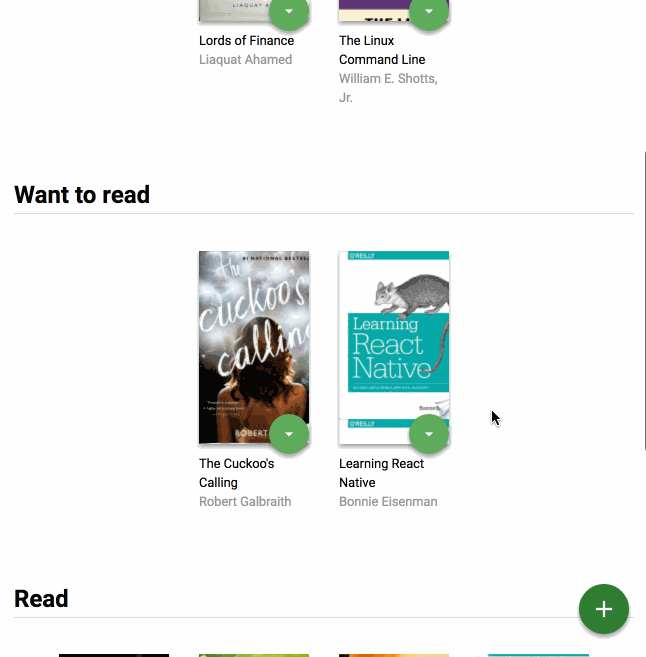

## MyReads Project - Udacity React Nanodegree

The focus of this project is on writing functional React code.



# Instalation
1. Clone this repo:
```
git clone https://github.com/paulakedouk/my-reads.git
```

2. Open that folder:
```
cd my-reads
```

3. Install dependencies:
```
npm install
```

3. Start the app:
```
npm start
```